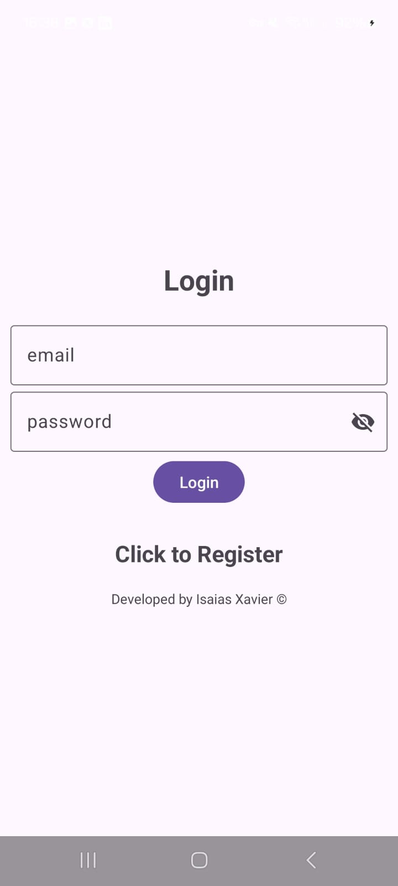
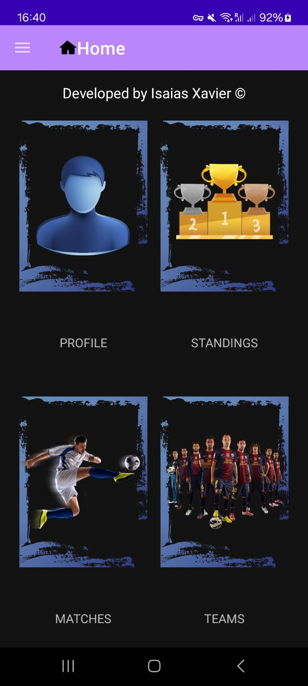
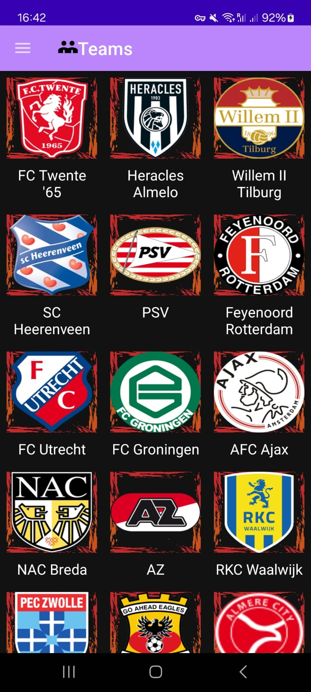
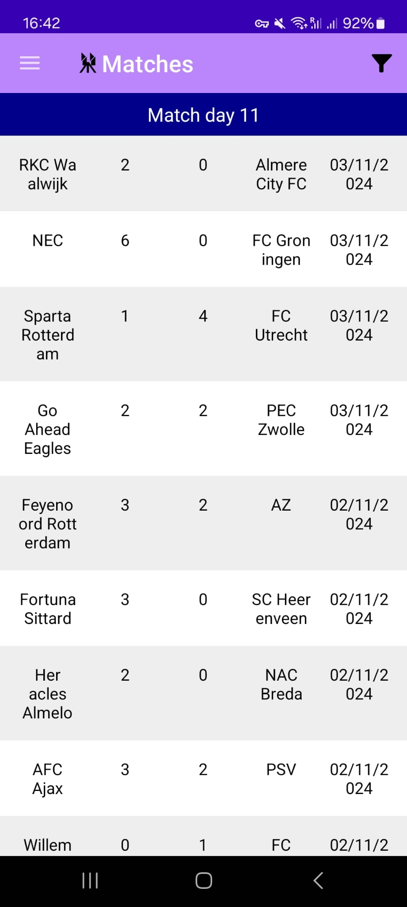
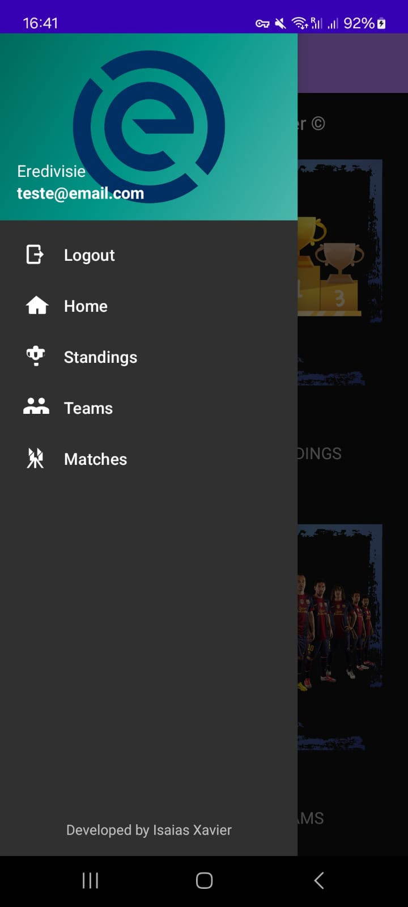
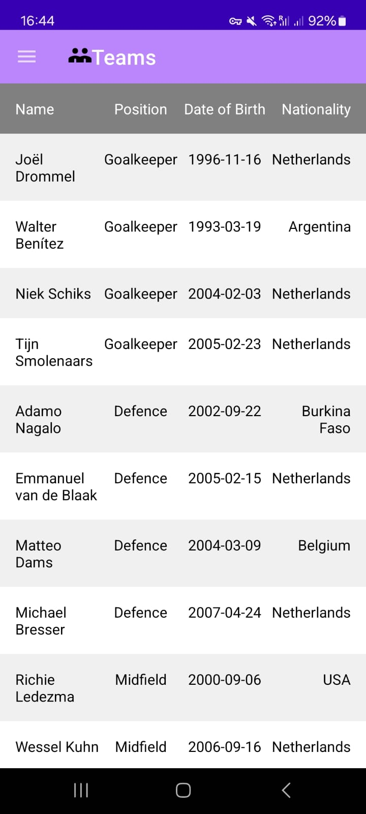
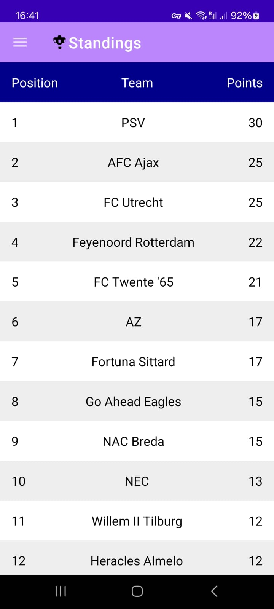
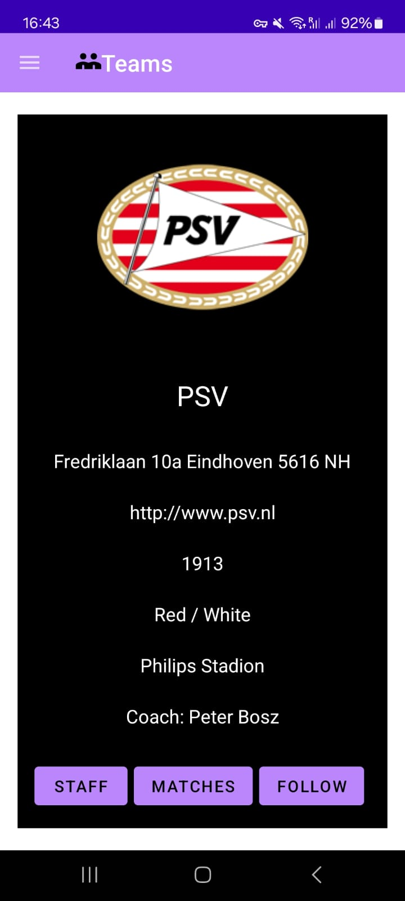

# Overview

<div style="display: flex; justify-content: space-around;">
  
  
  
  
</div>

<div style="display: flex; justify-content: space-around;">
  
  
  
  
</div>


**Eredivisie Tracker** is an app for Android dedicated to Eredivisie enthusiasts who want to stay updated on league 
standings, recent and upcoming matches, team details, and more. With a user-friendly interface, users can create an account, log in, and personalize their experience by following specific teams to receive personalized notifications.

## Key Features

- **User Authentication**: Register and log in securely to access the app's features.
- **Standings Table**: View the current Eredivisie standings with details on team rankings and points.
- **Match Calendar**: Explore a comprehensive schedule of matches, filtering by past or future games.
- **Team Insights**: Access detailed information about each Eredivisie team, including roster, coaching staff, and recent performances.
- **Follow Your Favorites**: Select and follow specific teams to receive updates on match results, schedule changes, and breaking news.

## Installation

### Clone the Repository

```bash
git clone https://github.com/IsaiasXavier/eredivisie.git
cd eredivisie
````

## Technologies

- **Programming Language**: Kotlin
- **Backend Integration**: REST API
- **Cloud Storage**: For user authentication and notification management

## Usage

### Create an Account
Sign up to save your preferences and receive team updates.

### Explore Standings and Matches
Navigate to the standings tab to see team rankings or check out the match tab to see schedules and results.

### Follow a Team
Select your favorite teams to follow and get notified about their games and standings.

## Future Enhancements

- **Push Notifications**: Real-time updates for game scores, schedule changes, and news.
- **Social Sharing**: Share match results and team stats with friends.

## Contributing

If you'd like to contribute to Eredivisie Tracker, please open a pull request. For any major changes, please open an issue first to discuss your ideas.

## Contact

Developed by Isaias Xavier  
For inquiries, reach out at [www.github.com/isaiasxavier].

